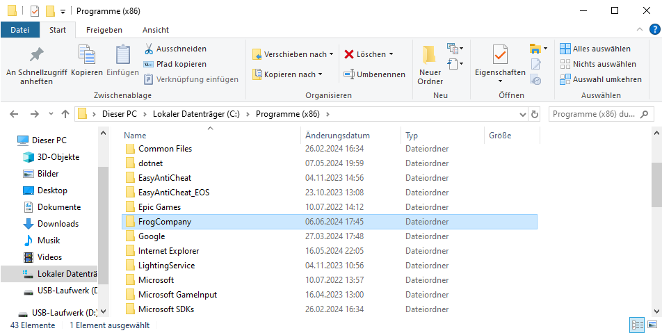
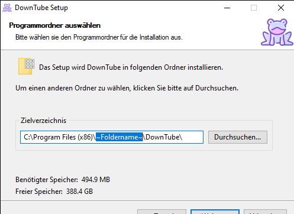

# Downloading any Youtube-Video!
by DudeLikesFrogs

## Purpose and Introduction

DownTube is an open source project that was primarily intended to give me a little challenge and simplify the downloading of YouTube videos.

## Legal situation

<li><b>legal</b>:
<br>Downloading YouTube videos for private use is not a criminal offense, as neither illegal videos have been downloaded 
(youtbe takes responsibility for ensuring that only legal videos appear on its platform, so it is not possible to download illegal videos with this app)
nor copyright-protected videos have been published.</li>
<br>
<li><b>illegal</b>:
<br>Downloading YouTube videos for public use, for example by sharing or reposting them, is punishable by law and may have criminal consequences.
It is therefore advisable to inform yourself about the legal situation before use (see bellow).
We are not liable for the use of the downloaded files and explicitly warn again that the incorrect use (e.g. publication) is illegal.</li>
<a href="https://www.saferinternet.at/themen/urheberrechte/9-rechtliche-fragen-zu-youtube-was-ist-erlaubt-was-nicht#:~:text=Alles%20darüber%20hinaus%2C%20also%20Verbreitung,und%20ist%20daher%20nicht%20erlaubt."> source 1</a>
<a href="https://www.allrecht.de/alles-was-recht-ist/youtube-videos-downloaden-legal-oder-nicht/"> source 2</a>
<a href="https://praxistipps.chip.de/download-von-youtube-videos-legal-oder-nicht_9496"> source 3</a>
<p>if you know any changes please let me know!!!</p>

## How to install
### Windows
First of all, this project mainly uses python so there are often Windowsefender-Issues when installing the application, because it thinks that the app is a trojan/virus.
<b>I can assure you it is not! <br>

<p>
  ++Create a folder wich is not affected by the Windowsdefender <br>
  1. create a folder preferably with the path "C:\Program Files (x86)\~name~" <br>
  (e.g. we use: "C:\Program Files (x86)\FrogCompany"):
  
  <br>
  
  2. open commandprompt(cmd) and type in this command:

  ``` cmd
    powershell -Command "Add-MpPreference -ExclusionPath 'C:\Path\To\Directory'"
  ```
  <br>
    in this example:
  <br>
  
  ``` cmd
    powershell -Command "Add-MpPreference -ExclusionPath 'C:\Program Files (x86)\FrogCompany'"
  ```
  
  3. open the installer downloaded from this repository and change the installationpath to the created directory
     and leave everything else as default:

     <br>
     
     
</p>


